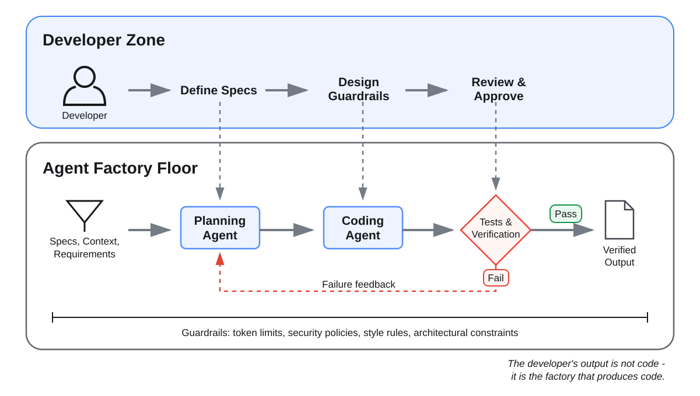
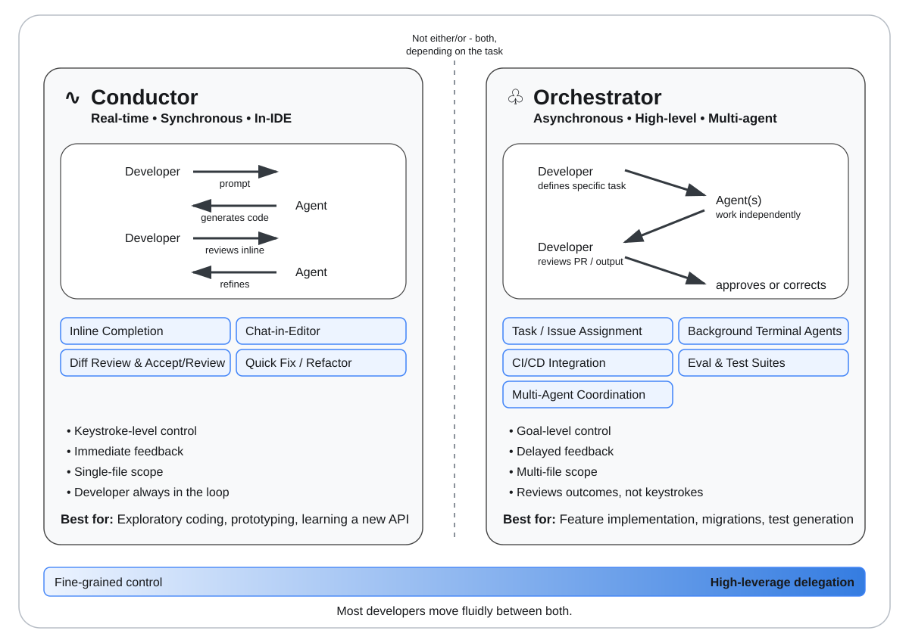

# OpenCode Global Config

Personal [OpenCode](https://opencode.ai) configuration. Applies globally across all projects via `~/.config/opencode/`.

## Goal: The Agent Factory



The goal of this setup is to build the system that builds software. The developer defines specifications and guardrails, then reviews and approves verified output. Agents plan and implement within those constraints; executable checks reject failures and route evidence back into the loop.

The factory consists of:

- Specifications and context that define the required outcome.
- Specialized agents that translate requirements into implementation.
- Tests and quality gates that produce evidence of correctness.
- Feedback loops that return failures for correction.
- Guardrails that constrain tools, security, architecture, and context usage.

## Developer Postures



### Conductor Mode (default)

Real-time, hands-on steering for exploration, debugging, unfamiliar code, and work that needs continuous developer direction. No process gates. Follow the small universal policy in `AGENTS.md`; language guidance loads only when relevant.

### Orchestrator Mode (`/orchestrator`)

Delegated production work for well-defined outcomes that benefit from independent implementation, verification, and evaluation. Every stage ends in a gate; no skipping or reordering.

```
Solution selection and acceptance contract → Baseline → Implementation
  → Verification → Evaluation → Human approval
```

| Stage | Sub-steps | What happens |
|---|---|---|
| **1 — Intent Specification & Harness Configuration** | SOLUTION SELECTION, BASELINE | Research the problem, recommend the smallest correct approach, agree on tradeoffs and the acceptance contract, then `@verifier` records baseline evidence. |
| **2 — Autonomous Implementation Loop** | IMPLEMENT | `@implementer` builds the complete feature using strict TDD and relevant skills. No production code without a failing test. |
| **3 — Verification & Evaluation Gates** | VERIFY, EVALUATE, STOP | `@verifier` runs canonical checks; `@reviewer` evaluates requirements, diff, evidence, security, and the difficult final 20%; the developer approves output. |

The main agent is a pure orchestrator: it never writes code or runs builds directly. Implementation, verification, and evaluation are delegated to specialists with scoped permissions. At the final gate it recommends the smallest fitting next step: finish locally, create one cohesive draft PR, or use `/delivery` for multiple separable review units.

### Guided Solution Selection

Before implementation, OpenCode checks whether code is needed, searches for an existing project solution, and prefers standard-library, native-platform, or already-installed capabilities. It recommends one approach and states the tradeoff that matters. Alternatives are shown only when they materially change behavior, risk, cost, or reversibility. If the task is still exploratory, OpenCode recommends staying in Conductor Mode instead of forcing it through the production harness.

### Delivery (`/delivery`)

Delivery is deliberately separate from building the feature. Use it only when a verified diff contains multiple independently understandable and testable concerns. After approval, `/delivery` asks `@architect` to produce `DELIVERY_PLAN.md`; `/next-pr` then creates each approved draft PR. Cohesive changes should use one draft PR instead.

### Guided Next Step

| Verified result | Recommended path |
|---|---|
| User wants working changes or further inspection | Finish locally; no Git action. |
| One cohesive review unit | Offer one draft PR after explicit approval. |
| Multiple separable, independently testable concerns | Recommend `/delivery`, then wait for approval of the split. |

## Harness Anatomy

| Layer | This setup |
|---|---|
| Instructions and rules | Lean global `AGENTS.md`, project `AGENTS.md`, commands, agent prompts, and on-demand skills. |
| Tools | OpenCode file, search, shell, web, task, skill, and GitHub tooling with global and per-agent permissions. |
| Execution environment | Host execution is OpenCode's current runtime. The instruction policy requires stopping before executing unknown repositories; sandboxing is external and not automatically enforced. |
| Orchestration | `/orchestrator` coordinates `@implementer`, `@verifier`, and `@reviewer`; `/delivery` invokes `@architect` after approval. |
| Guardrails and hooks | OpenCode permissions and `plugins/guardrails.ts` enforce selected tool restrictions. Git hooks, CI, and branch protection are repository-owned external controls. |
| Observability | OpenCode session logs, verifier command evidence, reviewer findings, Git history, and CI results. |

OpenCode provides the model runtime, sessions, tools, sub-agent execution, permissions, skills, plugins, and context compaction. This repository supplies the factory policy and specialist behavior. Each project supplies its executable contract through tests, evals, canonical commands, architecture rules, and CI.

## File Reference

| File | Purpose |
|---|---|
| `AGENTS.md` | Small universal policy loaded through `opencode.json`: quality, safety, Git, postures, and extension discovery. |
| `opencode.json` | OpenCode configuration for instructions, model, plugins, permissions, and context compaction. |
| `tui.json` | TUI settings (scroll acceleration). |
| `agents/architect.md` | Subagent definition for `@architect`. Runs System Decomposition, outputs `DELIVERY_PLAN.md`. Read-only except for the plan file. |
| `agents/implementer.md` | TDD implementation agent. Can edit and run common development checks, but cannot commit or push. |
| `agents/reviewer.md` | Subagent definition for `@reviewer`. Read-only evaluation agent. Reports PASS/FAIL with BLOCK/WARN findings. |
| `agents/verifier.md` | Read-only verification agent. Runs canonical checks and reports command evidence without fixing failures. |
| `plugins/guardrails.ts` | Deterministically blocks credential access, destructive commands, force pushes, and hook bypasses before tool execution. |
| `skills/go-engineering/SKILL.md` | Go engineering guidance loaded for Go tasks. |
| `skills/typescript-engineering/SKILL.md` | TypeScript and React guidance loaded for relevant tasks. |
| `skills/python-engineering/SKILL.md` | Python engineering guidance loaded for Python tasks. |
| `commands/orchestrator.md` | `/orchestrator` — switches the session into Orchestrator Mode. |
| `commands/delivery.md` | `/delivery` — decomposes approved verified output into a delivery plan. |
| `commands/tdd.md` | `/tdd` — strict Red/Green TDD protocol. Mandatory in the Autonomous Implementation Loop. |
| `commands/next-pr.md` | `/next-pr` — executes the next pending PR from `DELIVERY_PLAN.md`. |
| `commands/review.md` | `/review` — invokes `@reviewer` to run the EVALUATE gate on uncommitted changes. |

## Key Principles

- **TDD is mandatory** in Orchestrator Mode. No production code without a failing test first.
- **Build first, decompose later.** The full feature is built and verified before decomposing into PRs.
- **Delivery is separate.** Orchestrator Mode ends at human-approved verified output.
- **PRs are always drafts.** Never create a non-draft PR unless explicitly requested.
- **No TODOs in code.** Resolve everything before completing a task.
- **Standard library first.** Third-party dependencies require justification.
- **Progressive disclosure.** Language-specific instructions load only for matching work.
- **Context compaction.** OpenCode compacts full contexts automatically and prunes old tool output.

## Recommended Project Setup

Keep each project's `AGENTS.md` short and executable. Include only what differs by repository:

```markdown
# Project Instructions

## Stack
- Runtime, language, and major framework versions.

## Canonical Checks
- Format: `...`
- Lint: `...`
- Build: `...`
- Test: `...`

## Architecture
- Important module boundaries and dependency direction.

## Security
- Trust boundaries, sensitive paths, and forbidden operations.

## Learned Rules
- Add a rule only when an observed agent failure should not recur.
```

Tests and evals are the contract. Do not copy global policy or language standards into every project; the global `AGENTS.md` and on-demand skills already provide them.

## Control Levels

| Level | Meaning | Current examples |
|---|---|---|
| Instruction policy | The model is told what to do, but no deterministic control guarantees compliance. | Stop before executing unknown repositories; require production CI; use TDD; follow workflow gates. |
| OpenCode-enforced control | OpenCode permissions or plugin code blocks the action inside OpenCode. | Approval for commit/push, denial of destructive Git commands, scoped agent tools, sensitive-file and force-push blocking. |
| External enforcement | A system outside this config blocks or validates the action. | Container sandbox, Git hooks, required CI checks, secret scanning, and branch protection. |

Unknown-repository sandboxing and production CI are currently instruction policies, not runtime guardrails. To enforce them, launch OpenCode inside an isolated environment for untrusted code and configure required checks and branch protection in each production repository.

OpenCode session logs, verifier evidence, reviewer findings, Git history, and CI output are the current observability record. Add custom metrics only when an observed operational question requires them.

## OpenCode-Enforced Guardrails

OpenCode permissions and `plugins/guardrails.ts` protect actions performed through OpenCode. The plugin runs before tool execution, logs blocked attempts, and rejects access to credential/private-key files, destructive Git/filesystem commands, force pushes, and `--no-verify` bypasses.

Repository-owned controls remain authoritative outside OpenCode:

```text
OpenCode permissions and plugin -> agent tool calls
Git pre-commit hook             -> local canonical checks
CI                              -> merge-time tests, lint, build, and secret scan
```

For production repositories, configure the native pre-commit framework already used by the project to run its canonical check command. Repeat the checks and secret scanning in required CI; local hooks can be bypassed, CI cannot.

## Agent Skills

Skills are portable packages of procedural knowledge loaded through progressive disclosure:

1. OpenCode advertises each skill's name and description to the agent.
2. The agent loads `SKILL.md` only when the task matches.
3. The skill can direct the agent to read bundled references or run scripts only when needed.

This repository includes `go-engineering`, `typescript-engineering`, and `python-engineering`. Create another global skill package like this:

```text
skills/example-skill/
├── SKILL.md
├── references/
│   └── conventions.md
└── scripts/
    └── validate.sh
```

`SKILL.md` is the required entry point:

```markdown
---
name: example-skill
description: Performs an example task. Use when the user asks for it or mentions its relevant keywords.
---

# Example Skill

Follow the task-specific procedure here. Read `references/conventions.md` only when the task requires those conventions. Run `scripts/validate.sh` to verify the result.
```

The directory and frontmatter `name` must match, using lowercase hyphen-separated names. Keep `SKILL.md` focused on the procedure and put large or specialized details in bundled files. The description should state both what the skill does and when it applies because this lightweight metadata controls discovery.

Global skills under `~/.config/opencode/skills/` are discovered automatically. Project-specific skills use `.opencode/skills/`. Add `skills.paths` to `opencode.json` only for non-standard locations. Restart OpenCode after adding or changing a skill because configuration-time files are not hot-reloaded.
